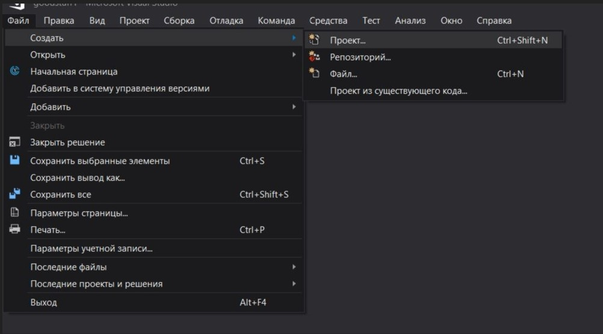
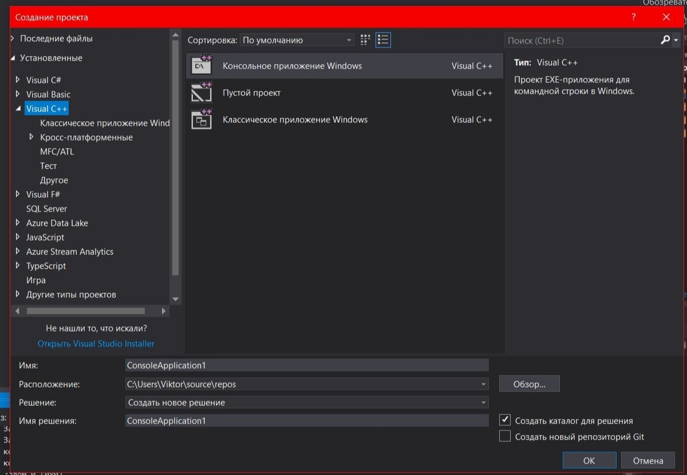
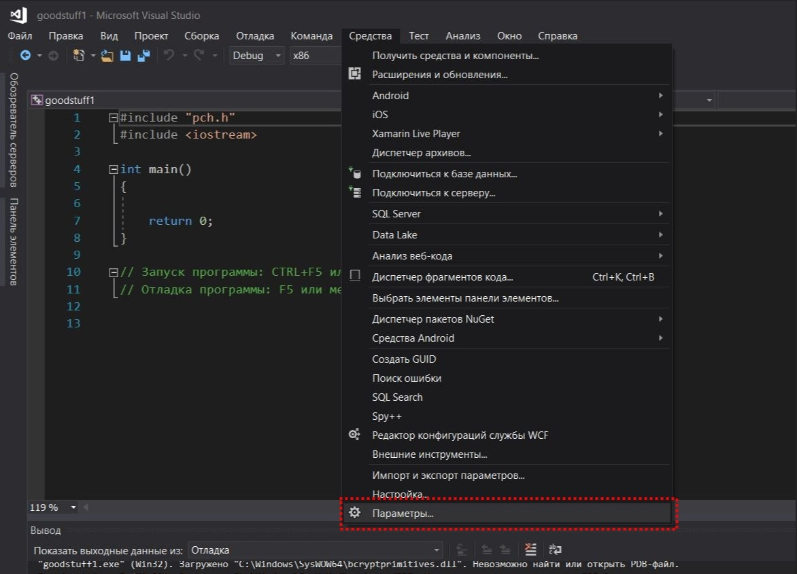
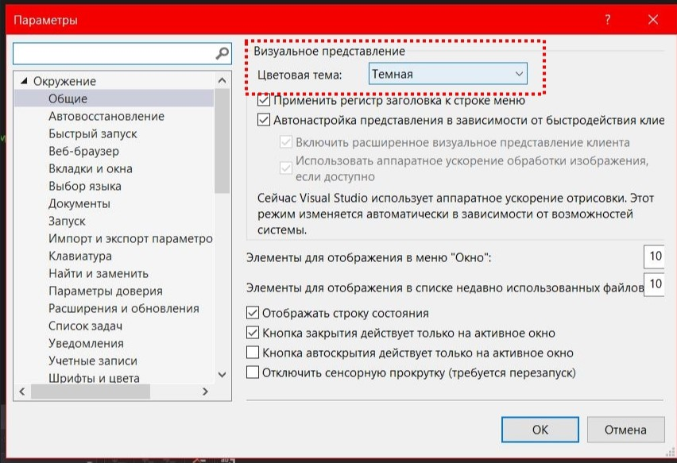
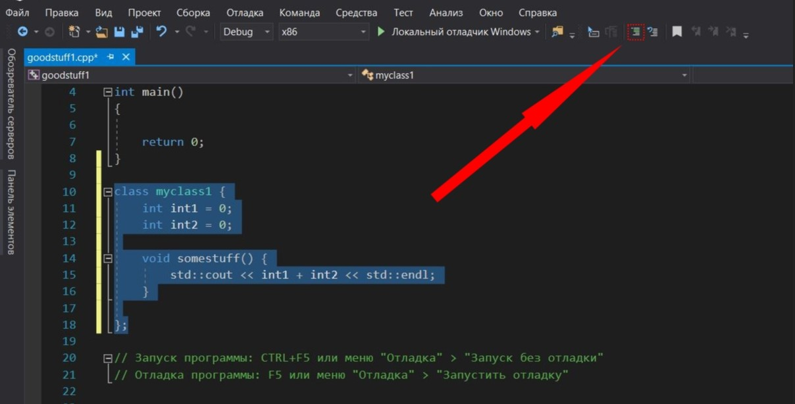
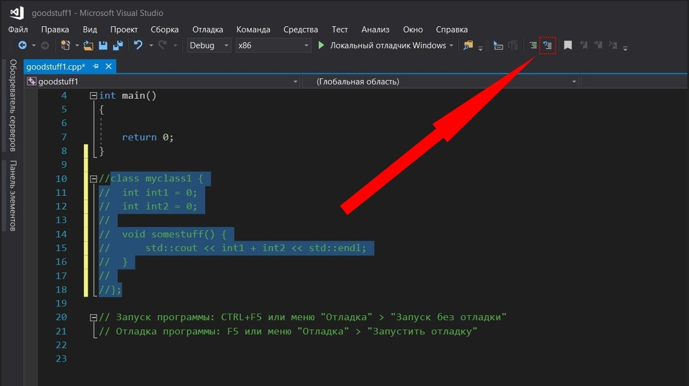
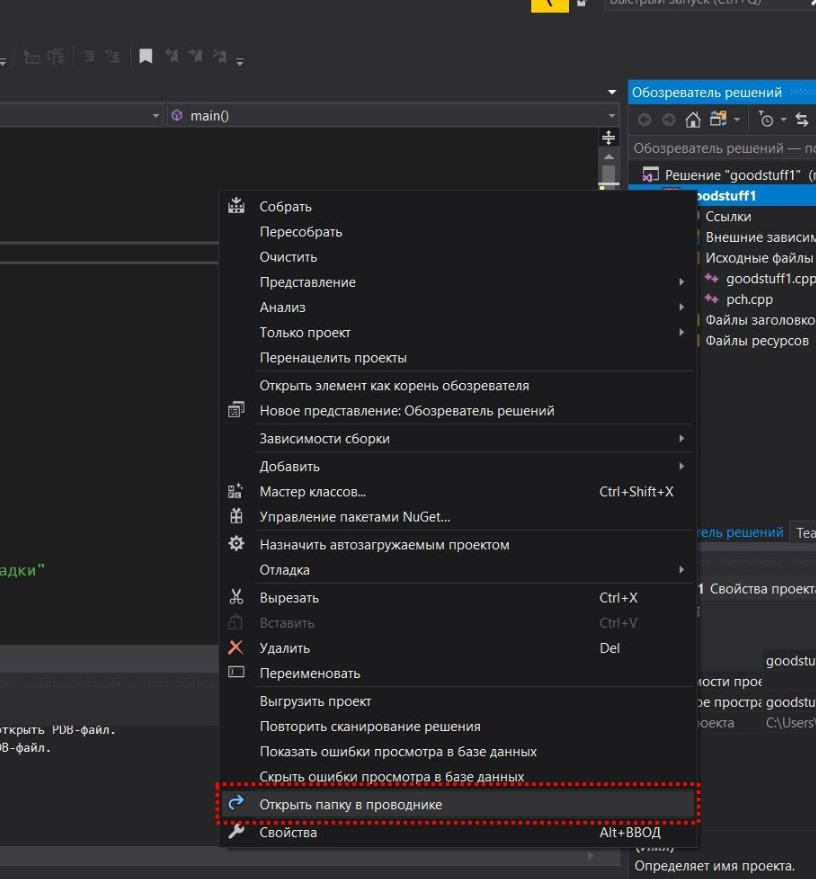
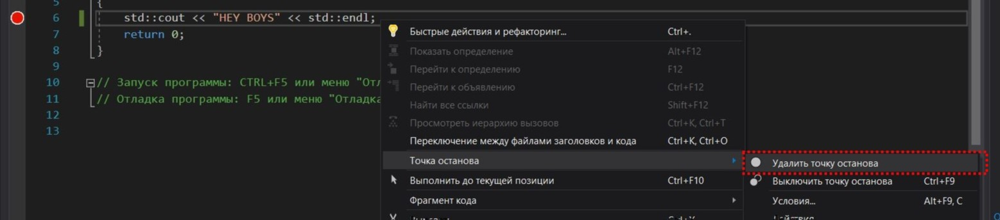
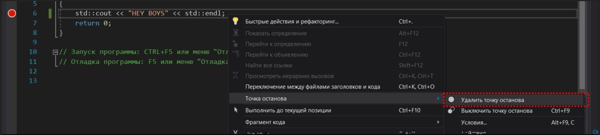

МИНИСТЕРСТВО НАУКИ  И ВЫСШЕГО ОБРАЗОВАНИЯ РОССИЙСКОЙ ФЕДЕРАЦИИ  
Федеральное государственное автономное образовательное учреждение высшего образования  
"КРЫМСКИЙ ФЕДЕРАЛЬНЫЙ УНИВЕРСИТЕТ им. В. И. ВЕРНАДСКОГО"  
ФИЗИКО-ТЕХНИЧЕСКИЙ ИНСТИТУТ  
Кафедра компьютерной инженерии и моделирования
<br/><br/>
​
### Отчёт по лабораторной работе № 1<br/> по дисциплине "Программирование"
<br/>
​
студента 1 курса группы ПИ-б-о-192(1)  
Спичека Игоря Дмитриевича
направления подготовки 09.03.04 "Программная инжерения"  
<br/>
​
<table>
<tr><td>Научный руководитель<br/> старший преподаватель кафедры<br/> компьютерной инженерии и моделирования</td>
<td>(оценка)</td>
<td>Чабанов В.В.</td>
</tr>
</table>
<br/><br/>
​
Симферополь, 2019

### Лабораторная работа № 1
Цель: изучить основные возможности создания и отладки программ в IDE MS Visual Studio.
<br/>
Ход работы
<br/>

### 1. Как создать консольное приложение C++?
- Для создания консольного приложения C++ нужно сделать следующее: 
Файл => Создать => Проект...

<p align="center">Рисунок 1. Окно создание проекта</p>

- Далее выбрать в окне вкладку "Visual C++", затем выбрать "Консольное приложение Windows", дать имя проекту, задать расположение и нажать кнопку "ОК".


<p align="center">Рисунок 2. Создание проекта</p>

### 2. Как изменить цветовую схему (оформление) среды?
- Для изменения цветовой схемы Visual Studio нужно сделать следующее:
Средства => Параметры => Общие => Цветовая тема


<p align="center">Рисунок 3-4. Смена цветовой темы</p>

### 3. Как закомментировать/раскомментировать блок кода средствами VS?
- Следует выделить код, который хотите закомментировать/раскомментировать и нажать на соответствующую кнопку (Рисунок 5-6)


<p align="center">Рисунок 5-6. Комментирование/раскомментирование</p>

### 4. Как открыть в проводнике Windows папку с проектом средствами VS?
- В обозревателе решений нажать правой кнопкой на проект и выбрать "Открыть папку в проводнике"

<p align="center">Рисунок 7. Открытие папки проекта в проводнике</p>

### 5. Какое расширение файла-проекта используется в VS?
- ".sln" (Visual Studio Solution)

### 6. Как запустить код без отладки (не менее 2 способов)?
- Нажать сочетание клавиш CTRL + F5 или меню "Отладка" => "Запуск без отладки".

### 7. Как запустить код в режиме отладки (не менее 2 способов)?
- Нажать F5 или меню "Отладка"=> "Запустить отладку".

### 8. Как установить/убрать точку останова (breakpoint)?
- Выбрать строку на которой вы хотите установить или удалить точку останова, нажать правой кнопкой мыши и выбрать "Точка останова" -> "Вставить точку останова" или "Удалить точку останова".


<p align="center">Рисунок 8-9. Точки останова</p>

### 9. Создать программу со следующим кодом:
```cpp
#include <iostream>

int main() {
  int i;
  i = 5; //Точка останова 1
  std::cout << i; //Точка останова 2
  return 0;
}
```
- Какое значение содержит переменная i в 5й строке? <br/>
Переменная i имеет значение -858993460


- Какое значение содержит переменная i в 5й строке? <br/>
Переменная i имеет значение 5


### 10. Выполнить задание 9 изменив программу на следующую:
```cpp
#include <iostream>

int main() {
  double i;
  i = 5; //Точка останова 1
  std::cout << i; //Точка останова 2
  return 0;
}
```
- Какое значение содержит переменная i в 5й строке? <br/>
Переменная i имеет значение -9.2559631349317831e+61


- Какое значение содержит переменная i в 5й строке? <br/>
Переменная i имеет значение 5.0000000000000000


### Вывод: изучил основные возможности создания и отладки программ в IDE MS Visual Studio.
