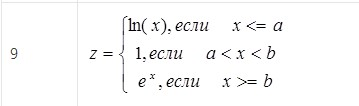
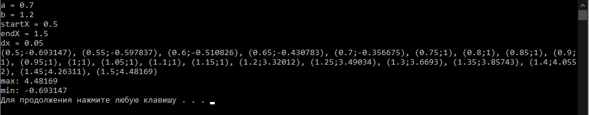
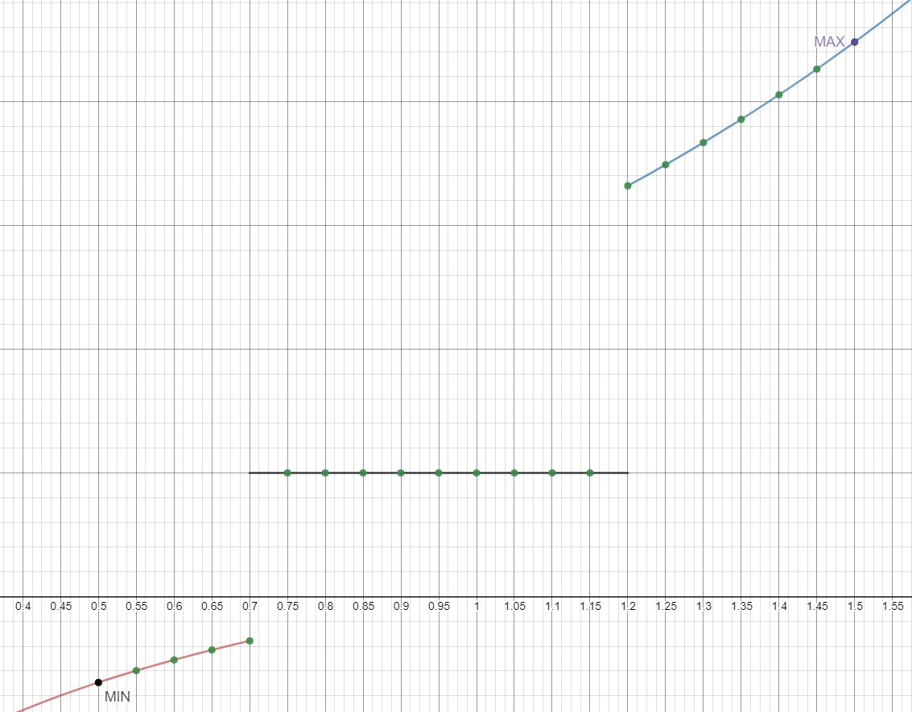

МИНИСТЕРСТВО НАУКИ И ВЫСШЕГО ОБРАЗОВАНИЯ РОССИЙСКОЙ ФЕДЕРАЦИИ
Федеральное государственное автономное образовательное учреждение высшего образования
"КРЫМСКИЙ ФЕДЕРАЛЬНЫЙ УНИВЕРСИТЕТ им. В. И. ВЕРНАДСКОГО"
ФИЗИКО-ТЕХНИЧЕСКИЙ ИНСТИТУТ
Кафедра компьютерной инженерии и моделирования
<br/><br/>
​
### Отчёт по лабораторной работе № 2<br/> по дисциплине "Программирование"
<br/>

студента 1 курса группы ПИ-б-о-192(1)\
Спичека Игоря Дмитриевича\
направления подготовки 09.03.04 "Программная инженерия"
<br/>
​
<table>
<tr><td>Научный руководитель<br/> старший преподаватель кафедры<br/>компьютерной инженерии и моделирования</td>
<td>(оценка)</td>
<td>Чабанов В.В.</td>
</tr>
</table>
<br/><br/>
​
Симферополь, 2019

* * *

## Цель:
1. Овладеть практическими навыками разработки и программирования вычислительного процесса циклической структуры;
2. Сформировать навыков программирования алгоритмов разветвляющейся структуры;
3. Изучить операторы ветвления. Особенности использования полной и сокращенной формы оператора if и тернарного оператора.

## Ход работы:
Написал программу которая для функции выводит в консоль значения функции с шагом dx, определяет максимальное и минимальное значение.


<p align="center">Рисунок 1. Данная функция</p>

* * *

```cpp
#include <iostream>
#include <math.h>

using namespace std;

double a, b, startX, endX, dx;

bool equal(double a, double b, double eps)
{
	return fabs(a - b) <= ((fabs(a) < fabs(b) ? fabs(b) : fabs(a)) * eps);
}

double f(double x) 
{
	if (x < a || equal(x, a, 0.01)) 
		return log(x);
	else if (x < b && x > a) 
		return 1;
	else if (x > b || equal(x, b, 0.01)) 
		return exp(x);
}

int main()
{
	cout << "a = ";
	cin >> a;

	cout << "b = ";
	cin >> b;

	cout << "startX = ";
	cin >> startX;
	
	cout << "endX = ";
	cin >> endX;

	cout << "dx = ";
	cin >> dx;

	double firstval = f(startX);
	cout << '('<<startX<<';'<<firstval<<')';
	double max = firstval;
	double min = firstval;

	for (double i = startX+dx; i <= endX+dx; i += dx) 
	{
		double val = f(i);
		cout << ", (" << i << ';' << val << ')';
		if (val > max) max = val;
		if (val < min) min = val;
	}


	cout << endl;
	cout << "max: " << max << endl;
	cout << "min: " << min << endl;

	return 0;
}

```


<p align="center">Рисунок 2. Вывод программы</p>

Запустил программу, ввел необходимые начальные данные и вписал вывод в таблицу:

x    | f
-----|-----
0.5  | -0.693147
0.55 | -0.597837
0.6  | -0.510826
0.65 | -0.430783
0.7  | -0.356675
0.75 | 1
0.8  | 1
0.85 | 1
0.9  | 1
0.95 | 1
1    | 1
1.05 | 1
1.1  | 1
1.15 | 1
1.2  | 3.32012
1.25 | 3.49034
1.3  | 3.6693
1.35 | 3.85743
1.4  | 4.0552
1.45 | 4.26311
1.5  | 4.48169

*Таблица 1. Вывод программы*

__Min__: -0.693147
__Max__: 4.48169

Используя https://www.desmos.com/calculator построил график функции (Рис.1), добавил на график точки, получившиеся в процессе табуляции.
Добавил на график точки минимума и максимума.


<p align="center">Рисунок 3. Изображение графика на Desmos</p>

* * *

## Вывод

Овладел практическими навыками разработки и программирования вычислительного процесса циклической структуры, сформировал навыки программирования алгоритмов разветвляющейся структуры, изучил операторы ветвления, особенности использования полной и сокращенной формы оператора if и тернарного оператора.